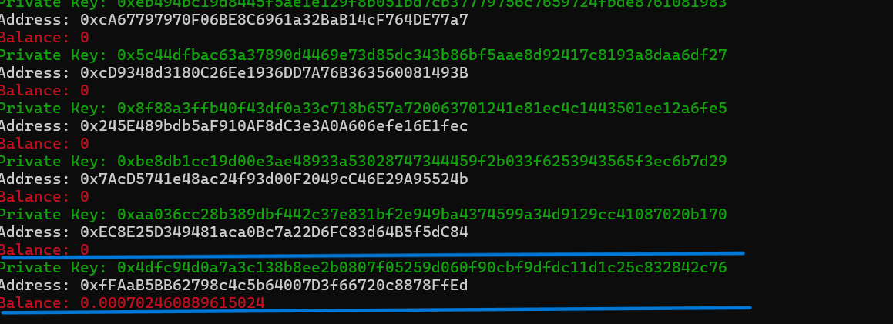

# Ethereum private key generator/Balance Checker
# ORIGINAL REPO
EthFinder: The Ultimate Ethereum Address Discovery Tool
Introducing EthFinder, a powerful multi-threaded Python script designed to uncover Ethereum addresses with existing balances. Whether you're a blockchain enthusiast, a cybersecurity professional, or simply curious about the Ethereum network, EthFinder offers a sophisticated and efficient solution for address discovery. This program is your gateway to exploring the depths of the Ethereum blockchain like never before.

Key Features:
High-Speed Multi-Threading

Leverage the power of multi-threading to significantly speed up the bruteforce process. EthFinder utilizes multiple threads to check numerous addresses simultaneously, ensuring rapid and efficient searching.
Real-Time Balance Detection

Instantly identify Ethereum addresses that hold a balance. Our program continuously scans and verifies addresses, alerting you as soon as a match is found.
Secure Data Handling#

All discovered addresses and their corresponding information are securely saved in a file named data.txt. This ensures you have a permanent record of your findings, safeguarded against data loss.

Install: 
```
git clone https://github.com/hackerpro03/ETH-HUNTER
cd ETH-HUNTER
python eth-scan.py
```
Or you can run it from binary files: https://github.com/hackerpro03/ETH-HUNTER/releases/download/b/eth-scan.zip



## ONLY FOR EDUCATIONAL
